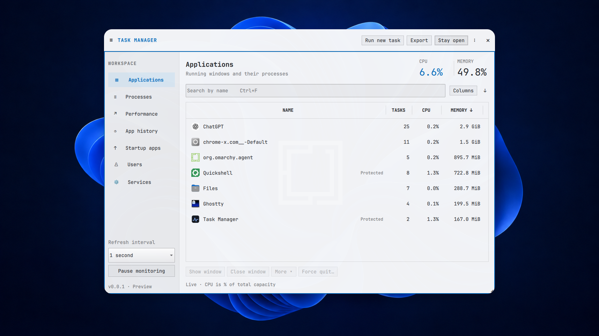

<h1 align="center">Task Manager for Omarchy</h1>

<p align="center">
  <a href="https://github.com/tcballard/omarchy-badges"></a>
</p>

**Find the frozen app. Get back to work.**

A graphical task manager for seeing what's running, finding what's slowing your computer down, and closing an app that won't cooperate. Familiar controls in a native, mouse-friendly floating window, with keyboard support and your Omarchy colours and fonts.



## Familiar when you need it

I built this because moving from Windows shouldn't mean relearning how to find a runaway process or close a frozen app. Sometimes you just want to find the application, close it, and carry on.

Start on Summary to see running applications and compact CPU and memory history, then find an app by name, check its use, and request a normal close. If it won't close, **Force quit** is available with confirmation; unsaved work may be lost. Performance graphs, startup apps, services and process details are there when you need to look deeper.

The screenshot above is from my XPS running Omarchy with the Familiar theme, captured on 21 September 2026.

## Install

For **Omarchy on x86_64, using the edge package channel**:

```bash
sudo pacman -Syu omarchy-task-manager
```

Open **Task Manager** from the app launcher, or run `omarchy-task-manager`.

The [edge package is live](https://github.com/omacom/omarchy-pkgs/pull/579#issuecomment-5766245954), but channel updates follow Omarchy’s separate publication process. For a newer preview, use the [GitHub release package](docs/GUIDE.md#build-and-run-on-omarchy).

### Keyboard shortcut

You can add **Super + Alt + Delete** to open Task Manager or focus it if it's already running. Follow the [one-time shortcut setup](docs/GUIDE.md#keyboard-shortcut); installation leaves your personal bindings alone.

## Make it yours

Drag the header to move the window and the bottom-right corner to resize it. Collapse the sidebar for more room, sort and resize columns, or turn on **Stay open** while you switch between applications. Navigation and column widths are remembered.

Use **Ctrl + F** to search, **Ctrl + N** to run a new task, and **Esc** to close. [All controls →](docs/GUIDE.md#familiar-controls)

## Update and remove

On edge, updates arrive with your normal system updates:

```bash
sudo pacman -Syu
```

Before removing or downgrading a version with background monitoring, switch it off in the menu or stop and disable its user service:

```bash
systemctl --user disable --now omarchy-task-manager-monitor.service
sudo pacman -R omarchy-task-manager
```

Removal keeps your preferences and history. Remove any shortcut you added separately. [Removal details →](docs/GUIDE.md#removal)

## A few useful details

**v0.0.5 preview.** The earlier release was tested on my XPS; the Summary and background monitoring still need live acceptance. Refinement continues through v0.0.n before v0.1.0. Full desktop acceptance and GPU accuracy checks remain in the [verification record](VERIFICATION.md).

Usage history stays local and is recorded while Task Manager is sampling. GPU readings depend on your driver; per-app network traffic isn't available. [Capabilities and limitations →](FEATURES.md)

<a id="build-and-run-on-omarchy"></a>

[Build and development guide](docs/GUIDE.md) · [Report a bug](https://github.com/tcballard/omarchy-task-manager/issues) · [Release notes](RELEASE_NOTES.md)

MIT licensed. [Credits](CREDITS.md). Made by [Tom Ballard](https://github.com/tcballard).
