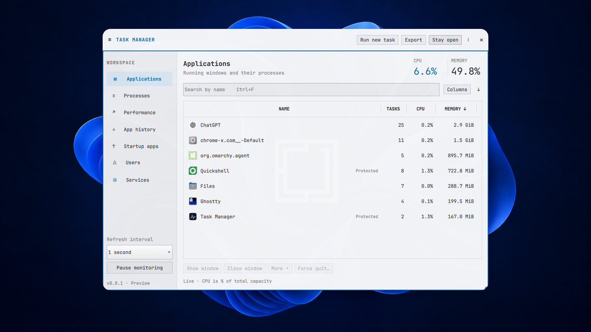

<h1 align="center">Task Manager for Omarchy</h1>

<p align="center">
  <a href="https://github.com/tcballard/omarchy-badges"></a>
</p>

<p align="center"><strong>Find the frozen app. Get back to work.</strong></p>

A native desktop task manager for Omarchy: find an application by name, check its resource use, and close it from a familiar, mouse-friendly window. Built for people who want to get back to work without learning Linux process tools, with keyboard support and your Omarchy colours and fonts. This is a standalone desktop app, not a shell plugin.



## Familiar when you need it

I built this because moving from Windows shouldn't mean relearning how to find a runaway process or close a frozen app. Sometimes you just want to find the application, close it, and carry on.

Start on Summary to see running applications and compact CPU and memory history, then find an app by name, check its use, and request a normal close. If it won't close, **Force quit** is available with confirmation; unsaved work may be lost. Performance graphs, startup apps, services and process details are there when you need to look deeper.

The screenshot above is from my XPS running Omarchy with the Familiar theme, captured on 21 September 2026.

### Which Task Manager?

This is **Task Manager for Omarchy**, maintained by **Tom Ballard** and installed as `omarchy-task-manager`. It provides a native graphical window with application controls, resource graphs and a normal-close-before-force-quit workflow.

[serverbauer's Omarchy Task Manager](https://github.com/serverbauer/omarchy-taskmanager) is a separate project: its README describes a keyboard-driven, `fzf`-based process/window picker with kill and restart actions. The names are similar, but these are different applications with different interaction styles.

## Install

For **Omarchy on x86_64**, Task Manager v0.1.1 is available through the Stable, RC and Edge package channels:

```bash
sudo pacman -Syu omarchy-task-manager
```

Open **Task Manager** from the app launcher, or run `omarchy-task-manager`.

[Omarchy published 0.1.1-1 to all three channels](https://github.com/omacom/omarchy-pkgs/pull/594#issuecomment-5838328794) on 25 September 2026. The [GitHub release](https://github.com/tcballard/omarchy-task-manager/releases/tag/v0.1.1) also offers a package and checksums for manual installation.

### Keyboard shortcut

You can add **Super + Alt + Delete** to open Task Manager or focus it if it's already running. Follow the [one-time shortcut setup](docs/GUIDE.md#keyboard-shortcut); installation leaves your personal bindings alone.

## Make it yours

Drag the header to move the window and the bottom-right corner to resize it. Collapse the sidebar for more room, sort and resize columns, or turn on **Stay open** while you switch between applications. Navigation and column widths are remembered.

Use **Ctrl + F** to search, **Ctrl + N** to run a new task, and **Esc** to close. [All controls →](docs/GUIDE.md#familiar-controls)

## Update and remove

Updates arrive with your normal system updates:

```bash
sudo pacman -Syu
```

Before removing or downgrading a version with background monitoring, switch it off in the menu or stop and disable its user service:

```bash
systemctl --user disable --now omarchy-task-manager-monitor.service
sudo pacman -R omarchy-task-manager
```

Removal keeps your preferences and history. Remove any shortcut you added separately. [Removal details →](docs/GUIDE.md#removal)

## A few useful details

**v0.1.1.** This update reduces sampling overhead, sends the full process list only to pages that use it, and isolates Qt tests from your live monitor. The v0.1.0 application was tested on my XPS, including Summary, background monitoring after closing and reopening the window, startup after logout/reboot, and GPU readings. The v0.1.1 changes have not yet been checked on that XPS; see the [verification record](VERIFICATION.md) and [release notes](RELEASE_NOTES.md) for the scope.

Usage history stays local and is recorded while Task Manager is sampling. GPU readings depend on your driver; per-app network traffic isn't available. [Capabilities and limitations →](FEATURES.md)

<a id="build-and-run-on-omarchy"></a>

[Build and development guide](docs/GUIDE.md) · [Report a bug](https://github.com/tcballard/omarchy-task-manager/issues) · [Release notes](RELEASE_NOTES.md)

MIT licensed. [Credits](CREDITS.md). Made by [Tom Ballard](https://github.com/tcballard).
